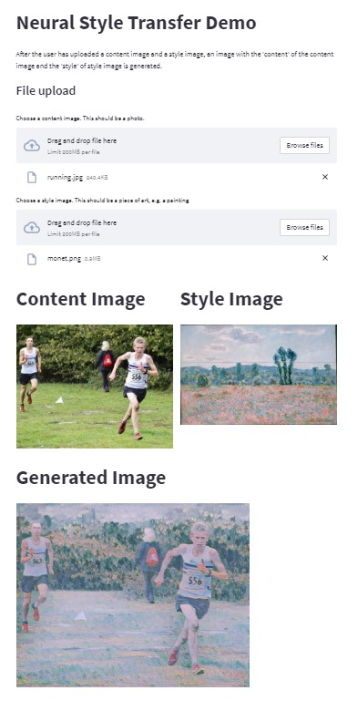

# Neural Style Transfer

After the user has uploaded a content image and a style image, an image with the 'content' of the content image and the 'style' of style image is generated. For example:

## User Instructions
### How to generate your own images
1. Click the above link: https://charlieblindsay-neural-style-transfer-app-5cov8f.streamlit.app/ to open the app. NOTE: the app may take around 30 seconds to load.
2. Upload the content and style images by clicking on the associated 'Browse files' button.
3. Wait for the image to be generated.

#### Screen recording showing above steps

### How is this done?
Machine Learning!

The generated image is initialized as the content image. On each iteration of an optimization algorithm (e.g. gradient descent), the image's pixel content is changed to reduce a cost function.

This cost function is the scaled adding of 2 components: the content cost and the style cost.
- The content cost function takes the content image and generated image as input. It measures the Euclidean distance between the activations of the content and generated image at a chosen layer in a pre-trained convolutional neural network (CNN). 
- The style cost function takes the style image and generated image as input. Firstly, the style matrices of the style and generated image are calculated for each layer in the CNN; the style matrix is an n_c x n_c (where n_c is the number of 'channels', a.k.a. features) matrix which represents the correlation of different features with eachother. The style cost is the Frobenius norm of the difference between these 2 matrices, averaged across all layers in the CNN.

##### Aside
I think this mathematical defition of the 'style' of an image is intriguing; 2 images have a similar style if the same low-level features, e.g. lines and curves, and high-level features occur in the same parts of the image.

#### CNN Used
The CNN architecture used is called VGG-19. The weights in each layer are pre-trained on imagenet data.

##### VGG-19 Architecture

To learn more about CNNs, click this link: https://towardsdatascience.com/a-comprehensive-guide-to-convolutional-neural-networks-the-eli5-way-3bd2b1164a53

## Developer Instructions
To run the streamlit app locally, enter this command in the terminal: streamlit run c:/PATH/TO/CURRENT/DIRECTORY/app.py

### Files
- app.py: Streamlit app
- utils.py: Contains utility functions used in app.py
- requirements.txt: Contains required Python modules. This file is necessary for hosting the app with Streamlit.
- model folder: Contains pre-trained model from https://www.tensorflow.org/tutorials/generative/style_transfer

### Future work
- Add option for the user to choose which layer is chosen to compare the 'content' of the content image and generated image. Choosing earlier layers would lead to high level features being compared, and vice-versa for choosing later layers.
- Add option to change the relative scaling of the content cost and style cost in the overall cost function. Increasing the scaling of the content cost would increase the importance of 'content' in the generated image and reduce the importance of 'style'.